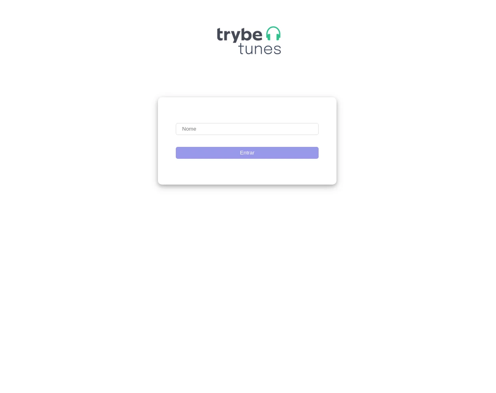
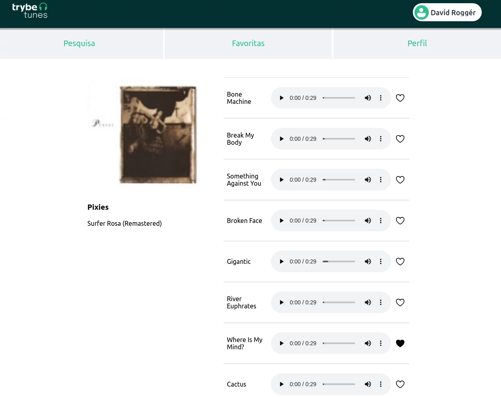
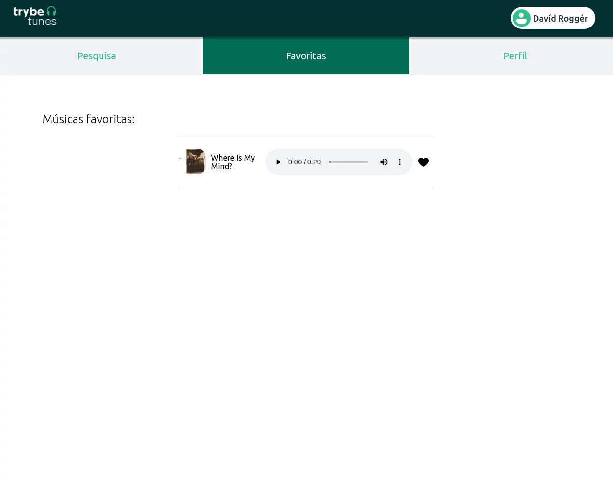

# Sobre

## Seção: `Ciclo de Vida de Componentes e React Router`
- Nessa seção foi apresentado metodos existentes para lidar com com ciclo de vida de elementos no react, componentDidMount, componentDidUpdate, componentWillUnmount, etc...
- Quando cada metodo é chamado dependendo da ação sobre o componente, sendo apresentando o melhor metodo para se usar para realizar requisições para um API lidando melhor com assincronicidade. Também apresenteado o React route, ja que o react é uma aplicação chamada de "Single page application" onde tudo é renderizado em uma mesma página, tornando a experiência durante a o uso, mais fluida, sem recarregamento da página.
#

  

>*clique na imagem para acesso online do projeto*
#
## Projeto: `Trybetunes`
- Desenvolver uma aplicação onde é inicialmente inserido o nome do usuário, que busca pelo nome da banda ou artitas, albuns relacionados, onde é possível ver seus albuns e pequenos fragmentos de som referentes aquele album coletados de uma API publica do itunes.
>[Figma base para o desenvolvimento](https://www.figma.com/file/BDQgAJvOe4KNUjmrYh5t68/TrybeTunes-Figma?node-id=0%3A1)

# Tecnologias e ferramentas usadas 🛠

# Desafios

- Initialmente determinar as rotas, para cada funcionalidade diferentes para o "single page". Seguindo do uso ciclo de vida de cada componente, para gerar a frase de carregando na parte do usuário dos albuns e das músicas. A parte mais pesada do projeto foi o uso do CSS puro, isso gera uma falta de produtividade muito grande, mas como meu foco era aprender os elementos do CSS então mantive dessa forma.

# Conclusão

- Projeto bem divertido, boa parte das funcionalidades que coletam as músicas do itunes, ja foram pré montadas pela trybe, pois o foco aqui era, de entender o funcionamento das rotas e uso do ciclo de vida do react.

  

    <strong>
      :newspaper_roll: Requisitos solicitados durante o desenvolvimento do projeto
    </strong>
  

 
### Requisitos
*Nome* | *Avaliação*
--- | :---:
1 - Crie as rotas necessárias para a aplicação | :heavy_check_mark:
2 - Crie um formulário para identificação | :heavy_check_mark:
3 - Crie um componente de cabeçalho | :heavy_check_mark:
4 - Crie os links de navegação no cabeçalho | :heavy_check_mark:
5 - Crie o formulário para pesquisar artistas | :heavy_check_mark:
6 - Faça a requisição para pesquisar artistas | :heavy_check_mark:
7 - Crie a lista de músicas do álbum selecionado | :heavy_check_mark:
8 - Crie o mecanismo para adicionar músicas na lista de músicas favoritas | :heavy_check_mark:
9 - Faça a requisição para recuperar as músicas favoritas ao entrar na página do Álbum | :heavy_check_mark:
10 - Faça a requisição para recuperar as músicas favoritas e atualizar a lista após favoritar uma música | :heavy_check_mark:
11 - Crie o mecanismo para remover músicas na lista de músicas favoritas | :heavy_check_mark:
12 - Crie a lista de músicas favoritas | :heavy_check_mark:
13 - Crie a exibição de perfil| :heavy_check_mark:
14 - Crie o formulário de edição de perfil | :heavy_check_mark:

  

    <strong>
      :memo: Todo list
    </strong>
  

  - [x] - ~~Criar aplicação com base nos requisitos da trybe.~~ 
  - [x] - Revisar Estilo dos elementos com base no figma. 
  - [ ] - Desenvolver testes automatizados.
  - [ ] - Adaptar elementos da aplicação para mobile.

#

  

